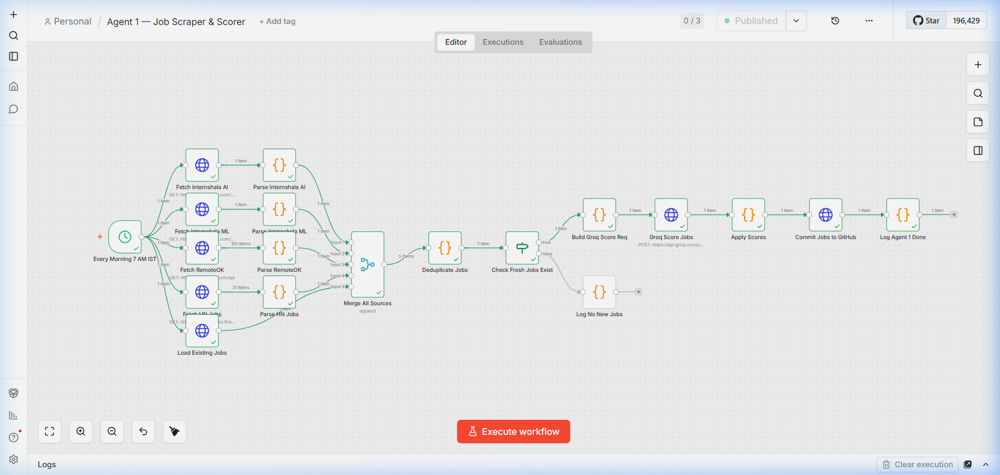

# AI Job Intelligence Pipeline

An autonomous, 3-agent AI pipeline built in n8n that scrapes job boards, scores relevance using Groq (LLM), generates tailored Harvard-style resumes, and delivers actionable email digests.



## Architecture

This system relies on three decoupled n8n workflows (agents) communicating via a shared GitHub repository state (`data/jobs.json`). 

### Data Flow Diagram

```mermaid
graph TD
    subgraph Agent 1: Scraper & Scorer
        A[Schedule: 7 AM] --> B(Scrape: Internshala, RemoteOK, HackerNews)
        B --> C{Deduplicate against GitHub state}
        C -- Fresh Jobs --> D[Groq: Score Relevance]
        D --> E[(Commit updated jobs.json to GitHub)]
    end

    subgraph Agent 2: Resume Generator
        F[Schedule: 8 AM] --> G(Fetch jobs.json)
        G --> H(Extract Top 5 Jobs)
        H --> I[Groq: Extract ATS Keywords]
        I --> J[Groq: Generate Tailored Resume]
        J --> K[Groq: Score ATS Match]
        K --> L[(Commit Resume & ATS Report to GitHub)]
    end

    subgraph Agent 3: Digest & Delivery
        M[Schedule: 8:30 AM] --> N(Fetch Top 5 Jobs)
        N --> O(Send Email Digest to User)
        O -- User Clicks APPROVE --> P[Webhook Trigger]
        P --> Q(Fetch Tailored Resume from GitHub)
        Q --> R(Send Email with Resume Attached)
    end
```



### The Agents

1. **Agent 1 (Scraper & Scorer)**: Aggregates listings from multiple sources, computes a unified SHA256 hash for deduplication, and prompts an LLM (`openai/gpt-oss-120b`) to score the relevance against a specific candidate profile (0-100).
2. **Agent 2 (Resume Generator & ATS)**: Retrieves the top 5 highest-scoring jobs, uses the LLM to extract the top 15 ATS keywords, writes a Harvard-style Markdown resume incorporating those keywords, and generates a self-evaluation ATS report.
3. **Agent 3 (Digest & Delivery)**: Compiles the top 5 jobs into a formatted HTML email. It includes an embedded `APPROVE` button linked to an n8n webhook. When clicked, it instantly delivers the pre-generated resume to the candidate's inbox.

---

## Realistic Failure Handling

This system is designed with real-world API flakiness in mind. Here is how it handles failures:

- **Empty Scrape Results:** If a job board changes its DOM or returns a 404, the scraper code catches the exception, injects a fallback `_sentinel` object, and proceeds. The merge node handles missing arrays gracefully.
- **LLM Malformed JSON:** If Groq fails to output valid JSON (e.g., includes conversational filler like "Here is the JSON:"), the downstream `Code` nodes use Regex (`/\[.*\]/s` or `/\{.*\}/s`) to forcefully extract the JSON block before parsing. If parsing utterly fails, the system applies a default `0` score or an empty keyword list rather than crashing the pipeline.
- **GitHub API Cache Stale:** GitHub's API can sometimes return stale state. To prevent overwriting data, Agent 1 compares SHAs and uses standard `append` logic in memory before the `PUT` request. (Note: True concurrent writes are not handled yet; agents are staggered by schedule to avoid race conditions).
- **Email Send Failure:** If Gmail SMTP limits are hit, the n8n node will throw an error and halt execution. (Known gap: No automatic retry is currently configured for SMTP failure).

---

## Setup & Deployment

### 1. Prerequisites
- Docker & Docker Compose installed.
- A GitHub repository with a Personal Access Token (Classic) with `repo` scope.
- A free Groq API Key.
- A Gmail account with an App Password.

### 2. Environment Variables
Copy the `.env.example` file to `.env` and fill in your credentials.
```bash
cp .env.example .env
```
*(Do not commit your `.env` file! It is already in the `.gitignore`.)*

### 3. Start n8n via Docker
Run the included `docker-compose.yml` to spin up n8n.
```bash
docker-compose up -d
```

### 4. Cloudflare Tunnel (Webhook Access)
Agent 3 requires a public webhook URL so the email "APPROVE" button can reach your local n8n instance.
```bash
# Run a quick Cloudflare tunnel pointing to n8n's port
cloudflared tunnel --url http://localhost:5678
```
Take the generated `https://...trycloudflare.com` URL and update the `WEBHOOK_URL` in your `.env`.

### 5. Import Workflows
1. Open n8n at `http://localhost:5678`
2. Navigate to **Workflows** -> **Add Workflow**
3. Select **Import from file...** and import the three JSON files located in the `/workflows` directory.


